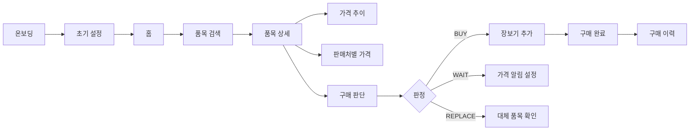

🛒 자취잘해
> **자취생을 위한 생활물가 비교 · 구매 판단 모바일 앱**  
> 공공데이터 기반 가격 정보를 모아 **지금 살지 / 기다릴지 / 대체할지** 판단할 수 있도록 돕습니다.


---
📌 한눈에 보기
구분	내용
서비스 목표	자취생의 장보기 가격 비교와 구매 판단 보조
핵심 기능	가격 비교, 구매 판단, 장보기 목록, 가격 알림
플랫폼	Mobile App 중심, Expo 기반 개발
주요 데이터	KAMIS, 한국소비자원 생필품 가격 정보, aT 도소매 가격, 식품영양성분 DB
화면 규모	정보구조도 기준 36개 화면
---
💡 핵심 가치
📊 가격 비교	🧠 구매 판단	📝 장보기 관리	🔔 가격 알림
평균가, 최저가, 최고가 확인	사기 / 기다리기 / 대체 추천	예상 합계와 구매 이력 관리	목표가 도달 이력 확인
---
🧭 서비스 흐름

---
✨ 주요 기능
🏠 홈
기능	설명
물가 요약	상승·하락·안정 품목 수와 갱신 시각 표시
추천 구매	사기 좋은 품목, 기다릴 품목, 대체 추천 품목 노출
최근 본 품목	사용자가 확인한 품목을 빠르게 다시 접근
알림 배지	가격 알림과 추천 정보 진입점 제공
🔍 검색 · 품목 상세
기능	설명
품목 검색	계란, 쌀, 우유, 세제 등 생활물가 품목 검색
카테고리 탐색	식품, 축산물, 생활용품, 농산물, 수산물, 개인위생 분류
가격 정보	현재 평균가, 최저가, 최고가, 30일 평균가 표시
가격 추이	7일 / 30일 / 90일 기준 가격 변동 확인
판매처별 가격	마트, 시장, 온라인 등 판매처별 가격 비교
지역별 비교	내 지역과 전국·타 지역 평균 비교
🧠 구매 판단
판정	의미	대표 문구
`BUY`	지금 사기 좋음	평균가보다 낮고 최근 가격 흐름이 안정적입니다.
`WAIT`	기다리기 추천	최근 평균보다 높거나 상승 흐름입니다.
`REPLACE`	대체 품목 추천	비슷한 품목 중 더 저렴한 대체 품목이 있습니다.
`NEUTRAL`	평균 수준	가격이 평균 수준입니다. 필요하면 구매하세요.
🛒 장보기 · 예산
기능	설명
장보기 목록	품목 추가, 수정, 삭제, 체크 처리
예상 합계	장보기 목록 기준 예상 총액 자동 계산
예산 요약	월 예산, 사용액, 남은 예산 확인
구매 이력	구매 완료한 품목을 이력으로 저장
🔔 가격 알림
기능	설명
목표가 알림	품목이 목표 가격 이하가 되면 알림 조건 저장
알림 ON/OFF	품목별 알림 활성화 상태 관리
알림 이력	목표가 도달, 가격 하락, 최저가 갱신 기록 확인
---
🗺️ 화면 구성
영역	화면 수	대표 화면
시작 흐름	2	온보딩, 초기 설정
홈	5	홈, 물가 요약, 추천 구매, 가격 변동 품목, 최근 본 품목
검색·상세·비교	19	검색, 카테고리, 품목 상세, 가격 추이, 판매처별 가격, 지역별 비교
장보기	5	장보기 목록, 품목 추가/수정, 예산 요약, 구매 완료, 구매 이력
알림	3	가격 알림 목록, 가격 알림 생성/수정, 알림 이력
MY	2	마이페이지, 설정/데이터 출처
<details>
<summary><strong>주요 라우트 보기</strong></summary>
구분	Route
온보딩	`/onboarding`
초기 설정	`/setup`
홈	`/home`
품목 검색	`/search`
검색 결과	`/search/results`
카테고리	`/categories`
품목 상세	`/items/:itemId`
가격 추이	`/items/:itemId/trend`
판매처별 가격	`/items/:itemId/sellers`
구매 판단	`/items/:itemId/decision`
가격 비교	`/compare/select`, `/compare/result`
장보기	`/shopping`
장보기 추가/수정	`/shopping/edit/:id?`
가격 알림	`/alerts`
마이페이지	`/mypage`
설정/데이터 출처	`/settings`
</details>
---
🧱 기술 스택
구분	기술
App Framework	Expo, React Native
Language	TypeScript
Navigation	React Navigation Native Stack, Bottom Tabs
State Management	Zustand
API Client	Axios
Planned Backend	REST API 서버
Planned Database	PostgreSQL
Planned Batch	공공데이터 가격 수집 Cron Job
---
📁 프로젝트 구조
```text
jachwijalhae/
├─ README.md
└─ apps/
   └─ mobile/
      ├─ App.tsx
      ├─ app.json
      ├─ index.ts
      ├─ package.json
      ├─ assets/
      └─ src/
         ├─ components/
         ├─ data/
         ├─ navigation/
         ├─ screens/
         ├─ services/
         ├─ store/
         ├─ theme/
         └─ types/
```
---
🚀 실행 방법
1. 저장소 클론
```bash
git clone https://github.com/yunjinhwa/jachwijalhae.git
cd jachwijalhae/apps/mobile
```
2. 패키지 설치
```bash
npm install
```
3. Expo 실행
```bash
npx expo start
```
4. 실행 방식 선택
방식	명령어
Expo Go QR 실행	`npx expo start`
Android 실행	`npm run android`
iOS 실행	`npm run ios`
Web 실행	`npm run web`
---
🔌 API 및 공공데이터
API 연동 방향
API	연결 화면	목적
`GET /home/summary`	홈	물가 요약, 추천, 알림 배지
`GET /items/search`	검색	품목 검색, 카테고리 검색
`GET /items/{id}/detail`	품목 상세	평균가, 판단, CTA
`GET /items/{id}/trend`	가격 추이	7/30/90일 가격 변화
`GET /items/{id}/sellers`	판매처별 가격	판매처별 가격 비교
`GET /items/{id}/decision`	구매 판단	BUY/WAIT/REPLACE 판정
`GET /shopping-list`	장보기	장보기 목록 조회
`GET /alerts`	가격 알림	알림 목록 조회
데이터 소스
데이터	활용
한국소비자원 생필품 가격 정보	생필품·생활용품 가격 비교
한국소비자원 상품별 통계	상품 단위 평균가, 통계 기준 표시
KAMIS 농수축산물 가격 정보	식재료 가격, 지역별 비교
aT 일자별 도소매 가격	가격 추이 차트
식품영양성분 DB	품목 기본 정보 보조
---
🧮 구매 판단 로직
```text
final_score =
  relative_score * 0.45
+ trend_score * 0.30
+ alternative_score * 0.15
+ volatility_penalty * 0.10
```
요소	의미
`relative_score`	현재가가 30일 평균보다 얼마나 낮은지
`trend_score`	최근 7일 가격 흐름이 하락인지 상승인지
`alternative_score`	대체 품목으로 절감 가능한 비율
`volatility_penalty`	가격 변동성이 높을 때 감점
---
✅ 개발 상태 체크
영역	상태
앱 라우팅 뼈대	진행
36개 화면 정의	완료
Mock 데이터 기반 화면	진행
API 연동	예정
가격 수집 배치	예정
배포 환경 분리	예정
---
🧪 테스트 체크리스트
구분	확인 항목
실행	Expo QR 실행, Android/Web 실행 확인
네비게이션	하단 탭 5개 이동 확인
검색	검색어 입력, 결과 있음/없음 화면 확인
상세	가격 정보, 가격 추이, 판매처별 가격 이동 확인
구매 판단	BUY/WAIT/REPLACE 문구와 CTA 확인
장보기	추가, 수정, 삭제, 체크, 구매 완료 확인
알림	알림 생성, ON/OFF, 이력 확인
설정	지역, 예산, 데이터 출처 화면 확인
---
🛠️ 문제 해결
PowerShell에서 `npx` 실행이 막히는 경우
```powershell
Set-ExecutionPolicy -Scope CurrentUser RemoteSigned
```
또는 아래 명령을 사용합니다.
```bash
npm run start
```
`Network request failed`가 뜨는 경우
원인	해결
모바일 기기에서 `localhost` 접근	PC의 내부 IP 주소 사용
API 서버 미실행	백엔드 또는 Mock API 실행 확인
HTTP 차단	개발 환경에서 허용 설정 확인
포트 불일치	앱의 API Base URL과 서버 포트 확인
---
📄 라이선스
현재 라이선스는 별도로 명시되어 있지 않습니다.
