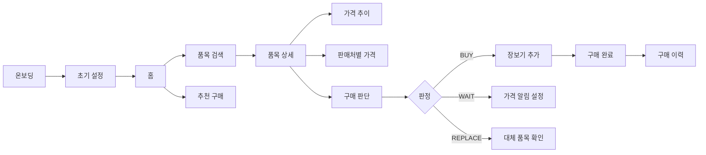

<div align="center">
🛒 자취잘해
자취생을 위한 생활물가 비교 · 구매 판단 모바일 앱
공공데이터 기반 가격 정보를 모아 지금 살지, 기다릴지, 대체할지 판단할 수 있도록 돕는 장보기 보조 앱입니다.
<br />


</div>
---
📌 목차
프로젝트 소개
핵심 가치
주요 기능
서비스 흐름
화면 구성
기술 스택
프로젝트 구조
실행 방법
API 및 공공데이터
구매 판단 로직
개발 상태
테스트 체크리스트
문제 해결
---
🧾 프로젝트 소개
`자취잘해`는 자취생이 장을 볼 때 겪는 다음 문제를 해결하기 위해 만든 모바일 앱입니다.
문제	해결 방식
같은 품목도 지역·판매처마다 가격이 다름	공공데이터 기반 평균가, 최저가, 판매처별 가격 비교
지금 사야 할지 기다려야 할지 판단하기 어려움	`BUY / WAIT / REPLACE` 구매 판단 제공
장보기 예산 관리가 번거로움	장보기 목록 예상 합계와 월 예산 요약 제공
가격이 내려갔는지 매번 확인해야 함	목표가 기반 가격 알림 제공
---
💡 핵심 가치
<table>
  <tr>
    <td align="center" width="25%"><strong>📊 가격 비교</strong><br />품목별 평균가, 최저가, 최고가 확인</td>
    <td align="center" width="25%"><strong>🧠 구매 판단</strong><br />사기 / 기다리기 / 대체 추천</td>
    <td align="center" width="25%"><strong>📝 장보기 관리</strong><br />목록, 예상 합계, 구매 이력 관리</td>
    <td align="center" width="25%"><strong>🔔 가격 알림</strong><br />목표가 도달 시 알림 이력 제공</td>
  </tr>
</table>
---
✨ 주요 기능
🏠 홈
기능	설명
이번 주 물가 요약	상승·하락·안정 품목 수와 갱신 시각 표시
추천 구매 품목	사용자 설정 기반 사기 좋은 품목, 기다릴 품목 노출
최근 본 품목	사용자가 확인한 품목을 빠르게 다시 접근
알림 배지	가격 알림, 추천 정보 진입점 제공
🔍 검색 · 품목 상세
기능	설명
품목 검색	계란, 쌀, 우유, 세제 등 생활물가 품목 검색
카테고리 탐색	식품, 축산물, 생활용품, 농산물, 수산물, 개인위생 등
가격 정보	현재 평균가, 최저가, 최고가, 30일 평균가 표시
가격 추이	7일 / 30일 / 90일 기준 가격 변동 확인
판매처별 가격	마트, 시장, 온라인 등 판매처별 가격 비교
지역별 비교	내 지역과 전국·타 지역 평균 비교
🧠 구매 판단
판정	의미	예시 문구
`BUY`	지금 사기 좋음	평균가보다 낮고 최근 가격 흐름이 안정적입니다.
`WAIT`	기다리기 추천	최근 평균보다 높거나 상승 흐름입니다.
`REPLACE`	대체 품목 추천	비슷한 품목 중 더 저렴한 대체 품목이 있습니다.
`NEUTRAL`	평균 수준	가격이 평균 수준입니다. 필요하면 구매하세요.
🛒 장보기
기능	설명
품목 추가/수정/삭제	직접 입력 또는 검색 기반 추가
예상 합계	장보기 목록의 예상 총액 자동 계산
예산 요약	월 예산, 이번 달 사용액, 남은 예산 확인
구매 완료	체크한 품목을 구매 이력으로 저장
🔔 가격 알림
기능	설명
목표가 알림	특정 품목이 목표 가격 이하가 되면 알림 조건 저장
알림 ON/OFF	품목별 알림 활성화 상태 관리
알림 이력	목표가 도달, 가격 하락, 최저가 갱신 기록 확인
👤 마이페이지
기능	설명
지역 설정	가격 비교 기준 지역 관리
예산 설정	월 장보기 예산 관리
알림 설정	푸시 알림 설정 관리
데이터 출처	공공데이터 출처 및 갱신 기준 확인
---
🧭 서비스 흐름

---
🗺 화면 구성
정보구조도 기준 총 36개 화면을 대상으로 앱 라우팅과 UI 흐름을 구성합니다.
영역	화면 수	대표 화면
시작 흐름	2	온보딩, 초기 설정
홈	8	홈, 물가 요약, 추천 구매, 가격 변동 품목, 최근 본 품목
검색/상세/비교	16	품목 검색, 검색 결과, 카테고리, 품목 상세, 가격 추이, 판매처별 가격, 가격 비교
장보기	5	장보기 목록, 품목 추가/수정, 예산 요약, 구매 완료, 구매 이력
알림	3	가격 알림 목록, 가격 알림 생성/수정, 알림 이력
MY	2	마이페이지, 설정/데이터 출처
<details>
<summary><strong>주요 라우트 보기</strong></summary>
화면	Route
온보딩	`/onboarding`
초기 설정	`/setup`
홈	`/home`
물가 요약	`/home/price-summary`
추천 구매	`/home/recommendations`
품목 검색	`/search`
검색 결과	`/search/results`
카테고리	`/categories`
카테고리 품목 목록	`/categories/:categoryId/items`
품목 상세	`/items/:itemId`
가격 추이	`/items/:itemId/trend`
판매처별 가격	`/items/:itemId/sellers`
구매 판단	`/items/:itemId/decision`
가격 비교 선택	`/compare/select`
가격 비교 결과	`/compare/result`
장보기 목록	`/shopping`
장보기 품목 추가/수정	`/shopping/edit/:id?`
가격 알림 목록	`/alerts`
가격 알림 생성/수정	`/alerts/edit/:id?`
마이페이지	`/mypage`
설정/데이터 출처	`/settings`
</details>
---
🧱 기술 스택
Mobile App
구분	기술
Framework	Expo
Runtime	React Native
Language	TypeScript
Navigation	React Navigation Native Stack, Bottom Tabs
State Management	Zustand
API Client	Fetch API, Axios dependency 포함
Styling	React Native StyleSheet
Platform	Android, iOS, Web
Planned Backend
현재 저장소는 모바일 앱 중심 구조이며, 백엔드는 REST API 기준으로 연동하도록 설계되어 있습니다.
구분	후보 기술
API Server	Node.js NestJS 또는 Spring Boot
Database	PostgreSQL
Cache	Redis
Batch	공공데이터 가격 수집 Cron Job
Deploy	dev / staging / production 환경 분리
---
📁 프로젝트 구조
```text
jachwijalhae/
├── README.md
└── apps/
    └── mobile/
        ├── App.tsx
        ├── app.json
        ├── index.ts
        ├── package.json
        ├── assets/
        └── src/
            ├── components/     # 공통 UI 컴포넌트
            ├── data/           # 화면 스펙, seed 데이터
            ├── hooks/          # API 리소스 훅
            ├── navigation/     # 앱 내비게이션
            ├── screens/        # 화면 컴포넌트
            ├── services/       # API 클라이언트
            ├── store/          # Zustand 상태 관리
            ├── theme/          # 색상, 간격, 타이포그래피
            ├── types/          # 도메인/라우팅 타입
            └── utils/          # 포맷, 내비게이션 유틸
```
---
🚀 실행 방법
1. 저장소 클론
```bash
git clone https://github.com/yunjinhwa/jachwijalhae.git
cd jachwijalhae
```
2. 모바일 앱 의존성 설치
```bash
cd apps/mobile
npm install
```
3. Expo 실행
```bash
npm start
```
또는 플랫폼별로 실행합니다.
```bash
npm run android
npm run ios
npm run web
```
Expo 실행 후 표시되는 QR 코드를 Expo Go 앱으로 스캔하면 모바일 기기에서 확인할 수 있습니다.
---
🔌 API 및 공공데이터
앱은 로컬 개발 환경에서 다음 형식의 API 서버와 통신하도록 구성됩니다.
```text
http://<Metro LAN Host>:4000/v1
```
모바일 기기에서 API를 호출하려면 앱을 실행하는 PC와 모바일 기기가 같은 Wi-Fi에 연결되어 있어야 합니다.
주요 API
그룹	Endpoint	설명
사용자	`POST /users/preferences`	지역, 예산, 관심 카테고리 저장
홈	`GET /home/summary`	홈 대시보드 요약
가격	`GET /prices/summary`	주간/월간 물가 요약
추천	`GET /recommendations`	BUY/WAIT/REPLACE 추천 목록
검색	`GET /items/search`	품목 검색
상세	`GET /items/{id}/detail`	품목 상세 개요
가격	`GET /items/{id}/prices`	현재가, 평균가, 최저가, 최고가
추이	`GET /items/{id}/trend`	7/30/90일 가격 추이
판매처	`GET /items/{id}/sellers`	판매처별 가격
판단	`GET /items/{id}/decision`	구매 판단 결과
장보기	`GET /shopping-list`	장보기 목록
알림	`GET /alerts`	가격 알림 목록
설정	`GET /data-sources`	데이터 출처
공공데이터 활용
데이터	앱 내 활용
한국소비자원 생필품 가격 정보	생필품, 생활용품 가격 및 판매처별 가격
한국소비자원 생필품 가격 정보 상품별 통계	상품 단위 평균가 및 가격 요약
KAMIS 농축수산물 가격 정보	농축수산물 가격, 지역별 비교, 가격 추이
aT 농축수산물 일자별 도소매 가격	일자별 도소매 가격 추이
식품영양성분DB	품목 기본 정보와 영양 정보 보조
> API 키는 모바일 클라이언트에 직접 저장하지 않고 서버 환경 변수로 관리하는 것을 전제로 합니다.
```env
KAMIS_API_KEY=
FOOD_NUTRITION_DB_API_KEY=
CONSUMER_PRODUCT_PRICE_API_KEY=
```
---
🧠 구매 판단 로직
구매 판단은 MVP 단계에서 규칙 기반 점수 모델로 시작합니다.
```text
relative_score = 30일 평균가 대비 현재가 점수
trend_score = 7일 가격 변동 점수
alternative_score = 대체 품목 절감률 점수
volatility_penalty = 가격 변동성 페널티

final_score = relative_score * 0.45
            + trend_score * 0.30
            + alternative_score * 0.15
            + volatility_penalty * 0.10
```
판정	기준 요약	사용자 행동
`BUY`	현재가가 30일 평균보다 낮고 최종 점수가 높음	장보기 목록에 추가
`WAIT`	현재가가 평균보다 높거나 상승 흐름	목표가 알림 설정
`REPLACE`	대체 품목 절감률이 충분히 높음	대체 품목 확인
`NEUTRAL`	평균 수준	필요 시 구매
> 구매 판단은 참고 정보이며, 실제 구매 결정은 사용자 판단을 기준으로 합니다.
---
📈 개발 상태
영역	상태
Expo 모바일 앱 기본 구조	✅ 진행
하단 탭 내비게이션	✅ 진행
36개 화면 기준 라우팅/스펙	✅ 진행
홈, 검색, 장보기, 알림, MY 주요 화면	✅ 진행
API 클라이언트 연결 구조	✅ 진행
공공데이터 seed 데이터	✅ 진행
백엔드 API 서버	⏳ 예정
PostgreSQL DB 스키마	⏳ 예정
가격 수집 배치	⏳ 예정
푸시 알림 실연동	⏳ 예정
배포 파이프라인	⏳ 예정
---
✅ 테스트 체크리스트
앱 실행
[ ] `npm install` 성공
[ ] `npm start` 성공
[ ] Expo Go에서 QR 실행 성공
[ ] Android 또는 iOS 에뮬레이터 실행 성공
화면 이동
[ ] 온보딩 → 초기 설정 이동
[ ] 초기 설정 완료 후 홈 이동
[ ] 하단 탭 5개 이동: 홈, 검색, 목록, 알림, MY
[ ] 홈 카드에서 상세 화면 이동
[ ] 검색 결과에서 품목 상세 이동
[ ] 품목 상세에서 가격 추이, 판매처별 가격, 구매 판단 이동
주요 기능
[ ] 품목 검색 동작
[ ] 카테고리 필터 동작
[ ] 정렬 버튼 동작
[ ] 장보기 품목 추가, 수정, 삭제
[ ] 장보기 예상 합계 표시
[ ] 가격 알림 생성, ON/OFF, 이력 확인
[ ] 데이터 출처 화면 표시
[ ] 로그아웃 버튼 표시 및 동작
예외 상태
[ ] API 서버가 꺼져 있을 때 Error 상태 표시
[ ] 검색 결과가 없을 때 Empty 상태 표시
[ ] API 요청 중 Loading 상태 표시
[ ] 네트워크 오류 후 재시도 가능
---
🛠 문제 해결
<details>
<summary><strong>Network request failed</strong></summary>
모바일 기기에서 로컬 API 서버에 접근하지 못할 때 발생할 수 있습니다.
확인할 항목은 다음과 같습니다.
API 서버가 `4000` 포트로 실행 중인지 확인
PC와 모바일 기기가 같은 Wi-Fi에 연결되어 있는지 확인
방화벽에서 `4000` 포트 접근이 차단되지 않았는지 확인
`apps/mobile/src/services/apiClient.ts`의 fallback LAN IP가 현재 PC IP와 맞는지 확인
</details>
<details>
<summary><strong>Windows PowerShell에서 npx 실행이 막히는 경우</strong></summary>
Windows PowerShell에서 스크립트 실행 정책 때문에 `npx expo start`가 막힐 수 있습니다.
대안은 다음과 같습니다.
CMD에서 실행
Git Bash에서 실행
현재 사용자 범위의 PowerShell 실행 정책 조정
</details>
<details>
<summary><strong>package.json path does not exist</strong></summary>
명령어를 저장소 루트에서 실행한 경우 발생할 수 있습니다.
모바일 앱 디렉터리로 이동한 뒤 다시 실행합니다.
```bash
cd apps/mobile
npm install
npm start
```
</details>
---
🌿 브랜치 전략 예시
브랜치	용도
`main`	안정 배포 기준
`develop`	통합 개발 기준
`feature/*`	기능 개발
`fix/*`	버그 수정
`docs/*`	문서 작업
---
📄 라이선스
현재 별도 라이선스가 지정되어 있지 않습니다.
---
<div align="center">
자취잘해  
생활물가를 비교하고, 더 똑똑하게 장보기 위한 모바일 앱
</div>
